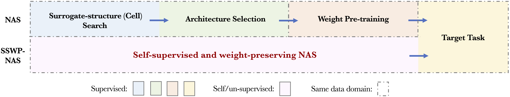
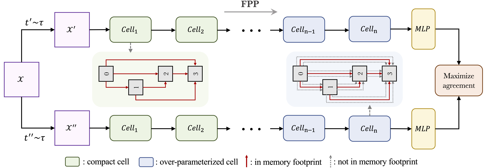

# Self-supervised-and-Weight-preserving-NAS

This is the official release for the paper **Towards Self-supervised and Weight-preserving Neural Architecture Search**

In this work, we propose the **S**elf-**s**upervised and **W**eight-**p**reserving **N**eural **A**rchitecture **S**earch (SSWP-NAS) as an extension of the current NAS framework by allowing the self-supervision and retaining the concomitant weights discovered during the search stage. As such, we simplify the workflow of NAS to a one-stage and proxy-free procedure. Experimental results show that the architectures searched by the proposed framework achieve state-of-the-art accuracy on CIFAR-10, CIFAR-100, and ImageNet datasets without using manual labels. Moreover, we show that employing the concomitant weights as initialization consistently outperforms the random initialization and the two-stage weight pre-training method by a clear margin under semi-supervised learning scenarios. 

Please refer to the full-paper for more details.

<div align="center">
  
</div>

<div align="center">
  
</div>

## Requirements
- Install PyTorch ([pytorch.org](http://pytorch.org))
- 'pip install -r requirements.txt'
- To use ImageNet, download the ImageNet dataset from http://www.image-net.org/. Then, move and extract the training and validation images to labeled subfolders, using [the following shell script](https://github.com/pytorch/examples/blob/main/imagenet/extract_ILSVRC.sh).

## Usages
### Search on cifar-10/100
```bash
CUDA_VISIBLE_DEVICES=0 python search_cifar.py --dataset 'cifar10' --data_path '/path/to/cifar10'
```

### Search on ImageNet
```bash
CUDA_VISIBLE_DEVICES=0,1 python search_imagenet.py --dataset 'imagenet' --data_path '/path/to/imagenet'
```

### Train from scratch on cifar-10/100
```bash
CUDA_VISIBLE_DEVICES=0 python train_cifar.py --dataset 'cifar10' --data_path '/path/to/cifar10' --path '/path/to/searched/folder' --cutout --auxiliary
```

### Train from scratch on ImageNet
```bash
CUDA_VISIBLE_DEVICES=0,1,2,3 python -m torch.distributed.launch --nproc_per_node 4 train_imagenet.py \
--data_path '/path/to/imagenet' --dataset 'imagenet' --path '/path/to/searched/folder' --arch_name 'specify the name of searched architure' --auxiliary --amp --ddp --sync_bn 
```

### Finetune on the searched architecture and preserved weights
```bash
CUDA_VISIBLE_DEVICES=0 python finetune.py --lr 0.2 --train_ratio 'data ratio you specify' --dataset 'cifar10' --data_path '/path/to/cifar10' --path '/path/to/searched/folder' --arch_name 'specify the name of searched architure' --cutout --auxiliary
```

### Use the searched architecture
First, download the searched result from [here](https://drive.google.com/file/d/1dlKbaIKijUZv7iq0tRtNX0Pn-Soj1tXO/view?usp=sharing). Then train from scratch or finetune using the above commands.

### Runtime Headup
Searching on cifar-10/100 dataset for 300 epochs will take around 1-2 days according to the GPU model used. As for ImageNet, it may consume up to 7-14 days to search for 250 epochs. 

